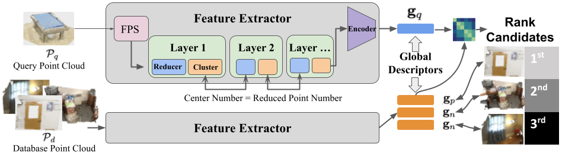
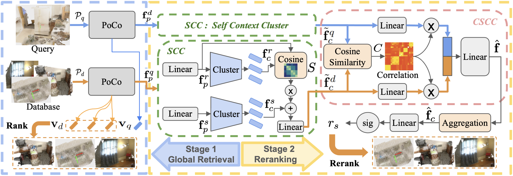

<div align="center">   
  
# PoCo - CSCPR
</div>


|  | 
|:--------------------------------------------------------:| 
|                      Stage 1: PoCo                       | 

|  | 
|:--------------------------------------------------------:| 
|                      Stage 2: CSCPR                      | 

[//]: # (> **ET-Former: Efficient Triplane Deformable Attention for 3D Semantic Scene Completion From Monocular Camera**.)

> [Jing Liang](https://jingliangc.github.io/), [Zhuo Deng](https://scholar.google.com/citations?user=AWWGTeIAAAAJ&hl=en), [Zheming Zhou](https://scholar.google.com/citations?user=LWKGD_kAAAAJ&hl=en&oi=ao), [Omid Ghasemalizadeh](https://scholar.google.com/citations?user=R4pXj28AAAAJ&hl=en&oi=ao), [Min Sun](https://scholar.google.com/citations?user=1Rf6sGcAAAAJ), [Cheng-Hao Kuo](https://scholar.google.com/citations?user=nvQampwAAAAJ&hl=en&oi=ao), [Arnie Sen](https://www.amazon.science/author/arnie-sen), [Dinesh Manocha](https://scholar.google.com/citations?user=X08l_4IAAAAJ)


>  [[PoCo PDF]](https://arxiv.org/pdf/2404.02885) [[CSCPR PDF]](https://arxiv.org/pdf/2407.17457)
>  [[PoCo Video]](https://youtu.be/D8dObAeMiCw) [[CSCPR Video]](https://youtu.be/DcXVHMpL4oQ?si=Ey5jeSMXcAdiKcAU) 
>  [[Project]](https://github.com/jingGM/PoCo-CCR.git)

## Getting Started

The code will come soon.

## Bibtex

If this work is helpful for your research, please cite the following BibTeX entry.

```
@inproceedings{liang2024poco,
  title={PoCo: Point context cluster for RGBD indoor place recognition},
  author={Liang, Jing and Deng, Zhuo and Zhou, Zheming and Ghasemalizadeh, Omid and Manocha, Dinesh and Sun, Min and Kuo, Cheng-Hao and Sen, Arnie},
  booktitle={2024 IEEE/RSJ International Conference on Intelligent Robots and Systems (IROS)},
  pages={14180--14187},
  year={2024},
  organization={IEEE}
}

@article{liang2025cscpr,
  title={CSCPR: Cross-Source-Context Indoor RGB-D Place Recognition},
  author={Liang, Jing and Deng, Zhuo and Zhou, Zheming and Sun, Min and Ghasemalizadeh, Omid and Kuo, Cheng-Hao and Sen, Arnie and Manocha, Dinesh},
  journal={IEEE Robotics and Automation Letters},
  year={2025},
  publisher={IEEE}
}
```