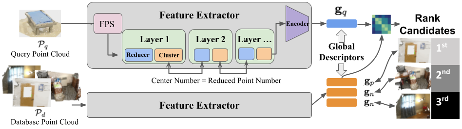
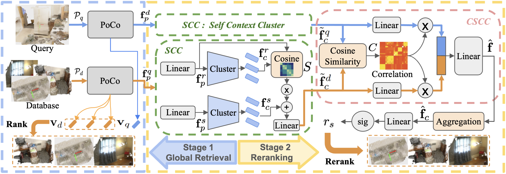

<div align="center">   
  
# PoCo - CSCPR
</div>


|  | 
|:--------------------------------------------------------:| 
|                      Stage 1: PoCo                       | 

|  | 
|:--------------------------------------------------------:| 
|                      Stage 2: CSCPR                      | 

[//]: # (> **ET-Former: Efficient Triplane Deformable Attention for 3D Semantic Scene Completion From Monocular Camera**.)

> [Jing Liang](https://jingliangc.github.io/), [Zhuo Deng](https://scholar.google.com/citations?user=AWWGTeIAAAAJ&hl=en), [Zheming Zhou](https://scholar.google.com/citations?user=LWKGD_kAAAAJ&hl=en&oi=ao), [Omid Ghasemalizadeh](https://scholar.google.com/citations?user=R4pXj28AAAAJ&hl=en&oi=ao), [Min Sun](https://scholar.google.com/citations?user=1Rf6sGcAAAAJ), [Cheng-Hao Kuo](https://scholar.google.com/citations?user=nvQampwAAAAJ&hl=en&oi=ao), [Arnie Sen](https://www.amazon.science/author/arnie-sen), [Dinesh Manocha](https://scholar.google.com/citations?user=X08l_4IAAAAJ)


>  [[PoCo PDF]](https://arxiv.org/pdf/2404.02885) [[CSCPR PDF]](https://arxiv.org/pdf/2407.17457)
>  [[PoCo Video]](https://youtu.be/D8dObAeMiCw) [[CSCPR Video]](https://youtu.be/mZ_LSmXJ-HU?si=HxR5czD1zRxzsjAG) 
>  [[Project]](https://github.com/jingGM/PoCo-CCR.git)

## Getting Started

### Environment
```
conda create -n pr python=3.10
conda activate pr
conda install pytorch==2.0.0 torchvision==0.15.0 pytorch-cuda=11.8 -c pytorch -c nvidia
pip install -r requirements.txt
mim install mmcv
conda install -c pytorch/label/nightly -c nvidia faiss-gpu

# check cuda first, make sure the system cuda is the same as pytorch
import torch
print(torch.cuda.is_available())

pip install -U git+https://github.com/NVIDIA/MinkowskiEngine -v --no-deps --config-settings="--blas_include_dirs=~/anaconda3/envs/wpr/include" --config-settings="--blas=openblas"

python setup.py install --blas_include_dirs=~/anaconda3/envs/wpr/include --blas=openblas
```

If there is issue of "libGL error: failed to load drivers: iris"
```
conda install -c conda-forge libstdcxx-ng
```


### Dataset
- [x] ARKit
- [ ] ScanNet-V2

#### You can either download [ARKitIPR](https://drive.google.com/drive/folders/14dn7Sd2W0b1gu8ZYNynzHBizLmmcoYXK?usp=sharing) or prepare the dataset by yourself by the following steps:
1. Download the datasets:
    ```
    python download_datasets/download_scannet.py  --out_dir="DATA ROOT"
    python download_datasets/download_arkit.py  --download_dir="DATA ROOT"
    ```

2. Generate datasets:

    Stages: 1 process the single frames; 2 combine information of all frames for training and select key frames for testing environment; 3 downsampled frames
    ```
    python generate_data.py --root="DATA_ROOT/3dod" --output="DATA_ROOT/ARKitPR" --type=0 --stage=0
    python generate_data.py --root="DATA_ROOT/scannet" --output="DATA_ROOT/ScanNetPR" --type=1 --stage=0
    ```
    The 5 stages should be executed in sequence.
   
## Training
Download pretrained models for [ScanNetIPR](https://drive.google.com/drive/folders/11ZiNjRcaKUh4Sv9XEavLDFQMq_gsyg_1?usp=sharing) and [ARKitIPR](https://drive.google.com/drive/folders/1liGC-WevkKewtp-VMHWyBHu8BBGePv7p?usp=sharing)
#### 1st stage:
```
python3 -m torch.distributed.launch --nproc_per_node=8 main.py --name="m0_scan"  --training_type=1 --mining_frequency=5 --mining_start=5 --mining_ratio=0.66 --recall_frequency=3 --evaluation_freq=5 --triplet_ratio=100 --circle_ratio=0.01 --model_type=0 --fine_layer=0 --batch_size=2 --neg_num=3 --pos_num=3 --only_load_model --max_iteration=50000 --snapshot="SNAPSHOT" --data_root="SCANNETPR DATA ROOT"
python3 -m torch.distributed.launch --nproc_per_node=8 main.py --name="m0_arkit" --training_type=2 --mining_frequency=3 --mining_start=0 --mining_ratio=0.66 --recall_frequency=3 --evaluation_freq=3 --triplet_ratio=100 --circle_ratio=0.01 --model_type=0 --fine_layer=0 --batch_size=2 --neg_num=3 --pos_num=3 --only_load_model --max_iteration=50000 --snapshot="SNAPSHOT" --data_root="ARKITPR DATA ROOT" 
```

#### generate data for the 2nd stage: --recall_data_type=0(training), 1(evaluation), 2(testing)
```
python3  main.py --name="m1_scanet" --training_type=2 --recall_frequency=1 --evaluation_freq=1 --fine_layer=1 --model_type=2 --only_load_model --neg_num=1 --pos_num=1 --instance_size=8 --data_root="" --snapshot="trained model from the 1st stage" --generate_data --recall_data_type=0
python3  main.py --name="m1_scanet" --training_type=2 --recall_frequency=1 --evaluation_freq=1 --fine_layer=1 --model_type=2 --only_load_model --neg_num=1 --pos_num=1 --instance_size=8 --data_root="" --snapshot="trained model from the 1st stage" --generate_data --recall_data_type=1
python3  main.py --name="m1_scanet" --training_type=2 --recall_frequency=1 --evaluation_freq=1 --fine_layer=1 --model_type=2 --only_load_model --neg_num=1 --pos_num=1 --instance_size=8 --data_root="" --snapshot="trained model from the 1st stage" --generate_data --recall_data_type=2
```

#### 2nd stage:
```
python3 -m torch.distributed.launch --nproc_per_node=8 main.py --name="m1_arkit_cross"   --training_type=2 --mining_frequency=-1 --mining_start=0 --mining_ratio=0.66 --recall_frequency=3 --fine_layer=1 --triplet_ratio=100 --circle_ratio=0.01 --evaluation_freq=3 --model_type=2 --neg_num=2 --pos_num=2 --batch_size=2 --only_load_model --data_root="ARKITPR DATA ROOT" --snapshot="SNAPSHOT" --max_iteration=50000
python3 -m torch.distributed.launch --nproc_per_node=8 main.py --name="m1_scannet_cross" --training_type=2 --mining_frequency=-1 --mining_start=0 --mining_ratio=0.66 --recall_frequency=3  --fine_layer=1 --triplet_ratio=100 --circle_ratio=0.01 --evaluation_freq=3 --model_type=2 --neg_num=2 --pos_num=2 --batch_size=2 --only_load_model --data_root="SCANNETPR DATA ROOT" --snapshot="SNAPSHOT" --max_iteration=50000
```

## Evaluation
#### evaluate stage 1:
```
python evaluation.py --data_root="Data Root/ARKitIPR" --instance_size=1 --model_type=0 --snapshot="ARKit_models/stage1.tar" --name="arkit_stage1" --generate_data --save_stage1
python evaluation.py --data_root="Data Root/ScanNetIPR" --instance_size=1 --model_type=0 --snapshot="ScanNet_Models/stage1.tar" --name="scannet_stage1" --generate_data --save_stage1
```

#### evaluate stage 2: Should evaluate stage 1 first to generate the first-stage results for stage 2.
```
python evaluation.py --data_root="Data Root/ScanNetIPR" --instance_size=20 --model_type=2  --snapshot="ScanNet_Models/stage2.tar" --name="scannet_stage2"
python evaluation.py --data_root="/media/jing/data_4tb_2/ARKitIPR" --instance_size=20 --model_type=2 --snapshot="ARKit_models/stage2.tar" --name="arkit_stage2"
```

## Bibtex

If this work is helpful for your research, please cite the following BibTeX entry.

```
@inproceedings{liang2024poco,
  title={PoCo: Point context cluster for RGBD indoor place recognition},
  author={Liang, Jing and Deng, Zhuo and Zhou, Zheming and Ghasemalizadeh, Omid and Manocha, Dinesh and Sun, Min and Kuo, Cheng-Hao and Sen, Arnie},
  booktitle={2024 IEEE/RSJ International Conference on Intelligent Robots and Systems (IROS)},
  pages={14180--14187},
  year={2024},
  organization={IEEE}
}

@article{liang2025cscpr,
  title={CSCPR: Cross-Source-Context Indoor RGB-D Place Recognition},
  author={Liang, Jing and Deng, Zhuo and Zhou, Zheming and Sun, Min and Ghasemalizadeh, Omid and Kuo, Cheng-Hao and Sen, Arnie and Manocha, Dinesh},
  journal={IEEE Robotics and Automation Letters},
  year={2025},
  publisher={IEEE}
}
```


## Acknowledgement

Many thanks to these excellent open source projects:
- [CGiS-Net](https://github.com/YuhangMing/Semantic-Indoor-Place-Recognition)
- [Context of Cluster](https://github.com/ma-xu/Context-Cluster)